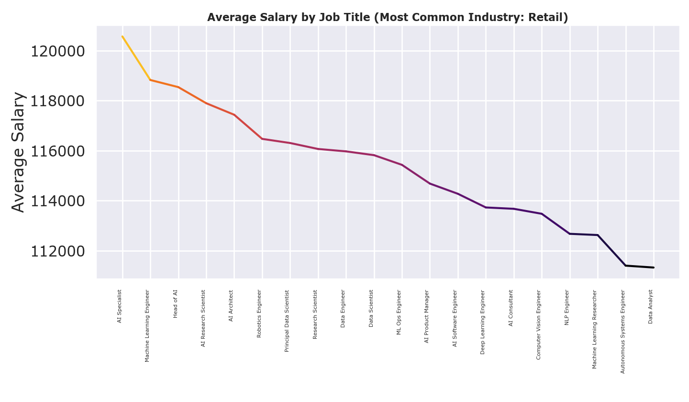

# AI Job Trends in 2025
**By: Tameem Suleiman**

## AI Market Salary Trends

I began by cleaning the data using the `pandas` library, which is a powerful tool for data manipulation and analysis in Python. The dataset contains various columns related to job postings in the AI field, including job titles, salaries, company names, experience levels, education requirements, and more.

In this code, I perform several data cleaning and preprocessing steps such as rename, drop, indexing, and replace:



```python
# Load dataset
df = pd.read_excel("data.xlsx", sheet_name="Sheet1")

# Data cleaning and preprocessing
df.rename(columns={"job_title": "Title", "salary_usd": "Salary",
                "company_name": "Company", "experience_level": "Level",
                "education_required": "Education", "years_experience": "Experience"}, inplace=True)

df["Experience"] = df["Experience"].replace({"SE": "Senior", "MI": "Mid", "EN": "Entry"})

df.drop(columns=["job_id", "salary_currency", "job_description_length", "benefits_score",
                 "application_deadline", "posting_date"], inplace=True)

# Start index count at 1
df.index = range(1, len(df) + 1)

# Display the first 10 rows of the DataFrame (For reference)
print(df.head(10))
```
Then, I set out to create a visually compelling way to show how average salaries vary by job title. I began by analyzing the dataset to identify the most common industry, which I included in the chart title for added context. Then, I grouped the data by job title, calculated average salaries, and sorted them in descending order to highlight the highest-paying roles. This helped me structure the visualization around meaningful salary insights.

For the chart, I chose a gradient line plot using the “inferno” colormap to create a modern, dramatic effect. However, the bright yellow at the high end was too intense, so I wrote a function to truncate the colormap and tone it down. I applied the gradient dynamically across salary segments, making the visual both intuitive and engaging. In the end, the chart clearly communicated salary trends while maintaining a polished, professional look.

```python
### Visualizing the data ###
# Count occurrences of each industry and find the most common one
count = df["industry"].value_counts()
most_common = count.idxmax()

# Group by job title and calculate average salary
df = df.groupby("Title")["Salary"].mean().reset_index()
df = df.sort_values(by="Salary", ascending=False)

# Truncate the colormap to remove bright yellow
def truncate_colormap(cmap, minval=0.0, maxval=0.85, n=256):
    new_cmap = LinearSegmentedColormap.from_list(
        f'trunc({cmap.name},{minval:.2f},{maxval:.2f})',
        cmap(np.linspace(minval, maxval, n))
    )
    return new_cmap

# Create a darker version of Inferno
cmap = truncate_colormap(get_cmap("inferno"), 0.0, 0.85)

# Create gradient line plot
fig, ax = plt.subplots(figsize=(14, 7))

norm = plt.Normalize(df["Salary"].min(), df["Salary"].max())
x = np.arange(len(df))
y = df["Salary"].values

for i in range(len(x) - 1):
    ax.plot(x[i:i + 2], y[i:i + 2], color=cmap(norm(y[i])), linewidth=3)

# Labeling
ax.set_xticks(x)
ax.set_xticklabels(df["Title"], rotation=90, ha="right")
ax.set_title(f"Average Salary by Job Title (Most Common Industry: {most_common})", fontsize=16, fontweight="bold")
ax.set_ylabel("Average Salary")

plt.tight_layout()
plt.show()
```
## WordCloud
This Python script was created to generate a visually compelling word cloud that highlights the most in-demand skills for AI jobs in 2025. Using data from an Excel file, the code processes the required_skills column, calculates frequency counts, and visualizes them with a color gradient that reflects skill prominence. The goal was to transform raw job data into an eye-catching summary that makes trends in AI skills immediately clear and engaging.


```# Load data
df = pd.read_excel("data.xlsx", sheet_name="Sheet1")
df.columns = df.columns.str.strip()

# Process skills
skills_series = df["required_skills"].dropna().str.split(', ')
all_skills = skills_series.explode().str.strip()
skill_counts = all_skills.value_counts()

# Frequency bounds
max_freq = skill_counts.max()
min_freq = skill_counts.min()

# Truncate inferno to remove yellow top
def truncate_colormap(cmap, minval=0.0, maxval=0.85, n=256):
    new_cmap = LinearSegmentedColormap.from_list(
        f'trunc({cmap.name},{minval:.2f},{maxval:.2f})',
        cmap(np.linspace(minval, maxval, n))
    )
    return new_cmap

# Create a smoother, darker inferno
original_cmap = get_cmap('inferno')
truncated_inferno = truncate_colormap(original_cmap, 0.0, 0.85)

# Define color function
def gradient_color_func(word, font_size, position, orientation, random_state=None, **kwargs):
    freq = skill_counts.get(word, 0)
    norm_freq = (freq - min_freq) / (max_freq - min_freq) if max_freq != min_freq else 0
    r, g, b, _ = truncated_inferno(norm_freq)
    return f"rgb({int(r*255)}, {int(g*255)}, {int(b*255)})"
```

I began by cleaning the dataset and focusing on the required_skills column. After splitting and flattening the skill entries, I calculated how often each skill appeared. To enhance the visual, I used a truncated version of the Inferno colormap to remove harsh yellows and mapped skill frequency to color using a custom function. This ensured the colors matched the data intensity.

```python
# Generate word cloud
wordcloud = WordCloud(width=1280,
                      height=1280,
                      background_color='white',
                      max_words=100,
                      color_func=gradient_color_func,
                      font_path='/Users/tameemsuleiman/Downloads/Montserrat/static/Montserrat-Black.ttf').generate_from_frequencies(skill_counts)

# Plot the word cloud
plt.figure(figsize=(24, 24))
plt.imshow(wordcloud, interpolation='bilinear')
plt.axis('off')
plt.title("Top Required Skills for AI Jobs in 2025", fontsize=16)
plt.tight_layout()

# Render the visualization
plt.show()
```

The final word cloud clearly emphasized the most common AI skills through both size and color. Frequent skills appeared larger and in brighter tones, while less common ones remained smaller and darker. The result was a clean, eye-catching visualization that made key trends in AI hiring immediately clear.
